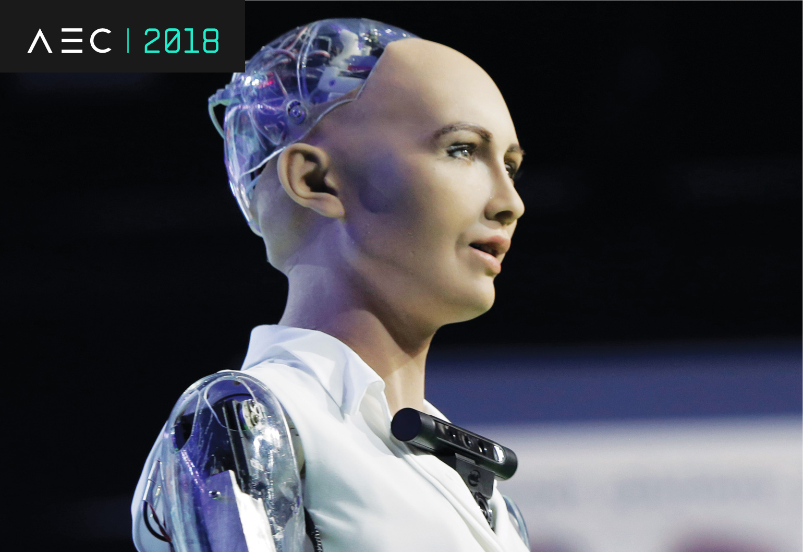

# Multi-Agent Control using Deep Reinforcement Learning

## Introduction

The goal in this project is to teach two agents to play a low-level version of tennis. By applying deep reinforcement learning to this environment, two seperate agents compete in order to define their individual policies. This method allows competition to essential become collaboration as agents compete to find the optimal policy. Read my blog on [Medium](https://ahtchow.medium.com/multi-agent-control-using-deep-reinforcement-learning-dc4c215bbb2c) for this project!


---
## Scaling RL in the Real-World

The purpose of this project is to outline the power that RL can be used in a multi-agent environment. The reality is that the world is a multi-agent environment in which intellegence is the developed by interacting with mutiple agents. If intellegence is to be developed for the future, the ability to interact with humans or other agents is required.



---
## Understanding the environment

**Summary**

In this environment, two agents control rackets to bounce a ball over a net. If an agent hits the ball over the net, it receives a reward of +0.1. If an agent lets a ball hit the ground or hits the ball out of bounds, it receives a reward of -0.01. Thus, the goal of each agent is to keep the ball in play.

**RL Problem Specifications**


    
-    **Goal of Agent** : keep the ball in play 
-    **Rewards** : ```+0.1``` every time agent hits the ball over the net, ```-0.1``` every time agent lets a ball hit the ground or hits the ball out of bounds
-    **Action Space** - Continuous, 4-Dimension Vector Space from [-1, +1]
-    **State Space** - Continuous, 8-Dimension, 3 Stacked Observations
-    **Solving Condition** : Average score of +0.5 over 100 consecutive episodes. 

**More on State and action spaces**

The observation space consists of 8 variables corresponding to the position and velocity of the ball and racket. Each agent receives its own, local observation. Two continuous actions are available, corresponding to movement toward (or away from) the net, and jumping.

**Solving the Environment**

The task is episodic, and in order to solve the environment, your agents must get an average score of +0.5 (over 100 consecutive episodes, after taking the maximum over both agents). Specifically,

- After each episode, we add up the rewards that each agent received (without discounting), to get a score for each agent. This yields 2 (potentially different) scores. We then take the maximum of these 2 scores.

- This yields a single score for each episode.

The environment is considered solved, when the average (over 100 episodes) of those scores is at least +0.5.

### Concepts and Resources used for this Project

Academic Resouce Papers:

* [Multi-Agent Actor-Critic for Mixed
Cooperative-Competitive Environments](https://papers.nips.cc/paper/2017/file/68a9750337a418a86fe06c1991a1d64c-Paper.pdf)


## Files Included in this repository

* The code used to create and train the Agent
* Multi-Agent-Cooperative-Competitive-Learning.ipynb : Driver code to run agent in environment!
* MADDPG.py : Multi-Agent Deep Deterministic Policy Gradient reinforcement agent
* networks.py : contains Actor and Critic neural networks
* replay_buffer.py : Replay Buffer Data Structure
* utils.py : helper functions for training
* OUNoise.py : Dynamic noise handler for action exploration
* A file describing all the packages required to set up the environment
* requirements.txt
* This README.md file

## Setting up the environment

This section describes how to get the code for this project and configure the environment.

### Getting the code
You have two options to get the code contained in this repository:
##### Option 1. Download it as a zip file

* [[click here]](https://github.com/ahtchow/Reinforcement-Learning-Collaboration-and-Competition/archive/master.zip) to download all the content of this repository as a zip file
* Uncompress the downloaded file into a folder of your choice

##### Option 2. Clone this repository using Git version control system
If you are not sure about having Git installed in your system, run the following command to verify that:

```
$ git --version
```
If you need to install it, follow [this link](https://github.com/ahtchow/Reinforcement-Learning-Collaboration-and-Competition) to do so.

Having Git installed in your system, you can clone this repository by running the following command:

```
$ git clone https://github.com/ahtchow/Reinforcement-Learning-Collaboration-and-Competition.git
```

### Configuring the environment
The `requirements.txt` file included in this repository describes all the packages and dependencies required to set up the environment. 

It is recommended that you [create a new conda environment](https://docs.conda.io/projects/conda/en/latest/user-guide/tasks/manage-environments.html), then use it to install ```pip install -r requirements.txt``` 

## How to train the Agent
The environment you have just set up has the files and tools to allow the training of the agent.  

Start the Jupyter Notebook server by running the commands below. A new browser tab will open with a list of the files in the current folder.

You must to set your operational system by downloading the appropriate executable coresponding to your OS. After you do this, drag and drop the correct files into the directory. (See Notebook for more instructions and clarificaiton)

The options available are:

Version 1: One (1) Agent:

Linux: [click here](https://s3-us-west-1.amazonaws.com/udacity-drlnd/P2/Reacher/one_agent/Reacher_Linux.zip)
Mac OSX: [click here](https://s3-us-west-1.amazonaws.com/udacity-drlnd/P2/Reacher/one_agent/Reacher.app.zip)
Windows (32-bit): [click here](https://s3-us-west-1.amazonaws.com/udacity-drlnd/P2/Reacher/one_agent/Reacher_Windows_x86.zip)
Windows (64-bit): [click here](https://s3-us-west-1.amazonaws.com/udacity-drlnd/P2/Reacher/one_agent/Reacher_Windows_x86_64.zip)

Version 2: Twenty (20) Agents:

Linux: [click here](https://s3-us-west-1.amazonaws.com/udacity-drlnd/P2/Reacher/Reacher_Linux.zip)
Mac OSX: [click here](https://s3-us-west-1.amazonaws.com/udacity-drlnd/P2/Reacher/Reacher.app.zip)
Windows (32-bit): [click here](https://s3-us-west-1.amazonaws.com/udacity-drlnd/P2/Reacher/Reacher_Windows_x86.zip)
Windows (64-bit): [click here](https://s3-us-west-1.amazonaws.com/udacity-drlnd/P2/Reacher/Reacher_Windows_x86_64.zip)


Use the jupyer notebook, Navigation.ipynb to run the models against the Unity Environment.


### Additional Notes

This environment has been built using the **Unity Machine Learning Agents Toolkit (ML-Agents)**, which is an open-source Unity plugin that enables games and simulations to serve as environments for training intelligent agents. You can read more about ML-Agents by perusing the [GitHub repository](https://github.com/Unity-Technologies/ml-agents).  

The project environment is similar to, but not identical to the Tennis environment on the [Unity ML-Agents GitHub page](https://github.com/Unity-Technologies/ml-agents/blob/master/docs/Learning-Environment-Examples.md).